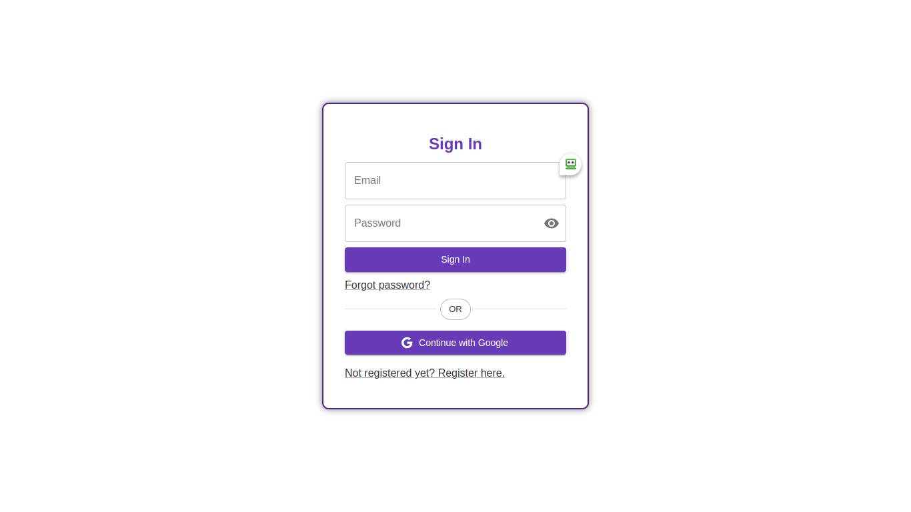
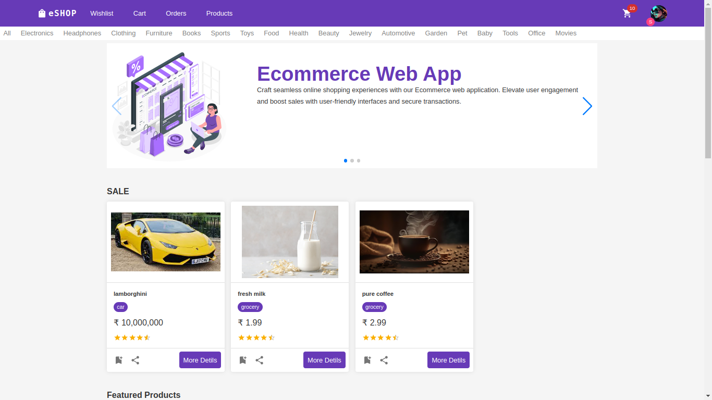
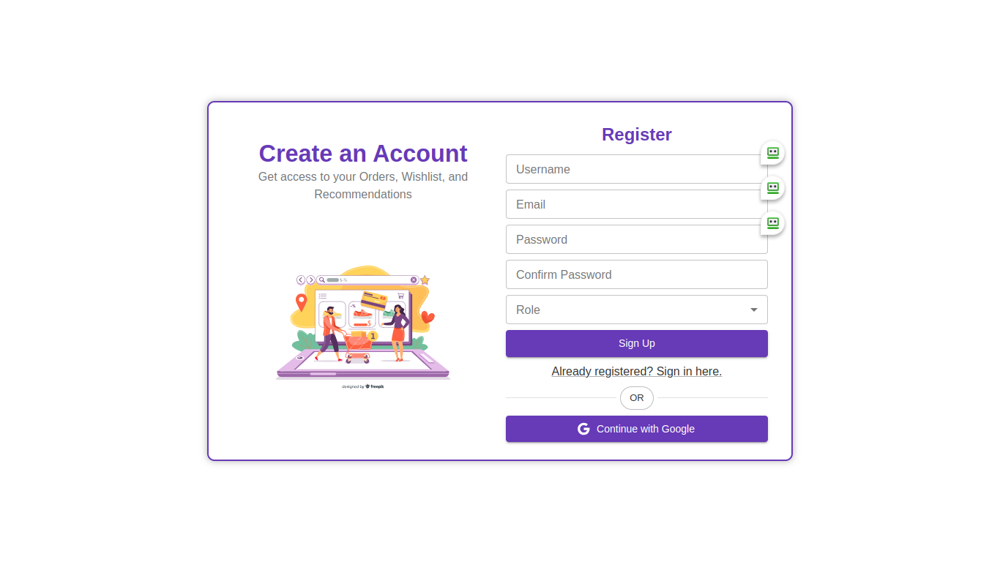
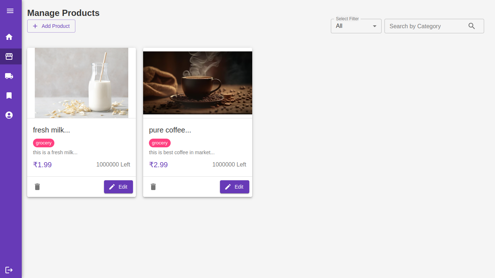

# E-Shopping Web Application

The e-shopping web application is a versatile platform that serves multiple user roles: buyers and shopkeepers. Built on Next.js and Material UI, it provides an intuitive interface for efficient online transactions.

## Key Features

### User Roles

- **Buyers:** Explore products, add to cart, make purchases, and manage account details.
- **Shopkeepers:** Manage inventory, add/update/remove products, track sales, and manage orders.

### Product Management

- **Shopkeeper Dashboards:** Add new products with details like images, descriptions, prices, and inventory. Edit existing product information and manage stock availability.

### User-friendly Interface

- Utilizes Material UI for a seamless, visually appealing experience.
- Ensures ease of navigation, responsiveness across devices, and a modern look and feel.

### Cart and Checkout

- Buyers can add products to their cart, review selections, and proceed to a secure checkout with various payment options.

### Authentication and Authorization

- Robust mechanisms for secure access and personalized experiences based on roles and permissions.

## Technology Stack

- **Next.js:** Leverages server-side rendering for better performance and SEO optimization.
- **Material UI:** Offers a wide array of pre-built components for a polished UI/UX.
- **Database:** Likely uses MongoDB, MySQL, or Firebase for storing product information, user data, and transactions.

## Screenshots

### Login Page

### Home Page

### Register Page

### Manage Products Page

## Running Locally

To run the project on your machine:

1. Clone the repository.
2. Run `npm install` to install dependencies.
3. Execute `npm run dev` to start the development server.
4. Visit `localhost:3000` in your browser to view the application.
